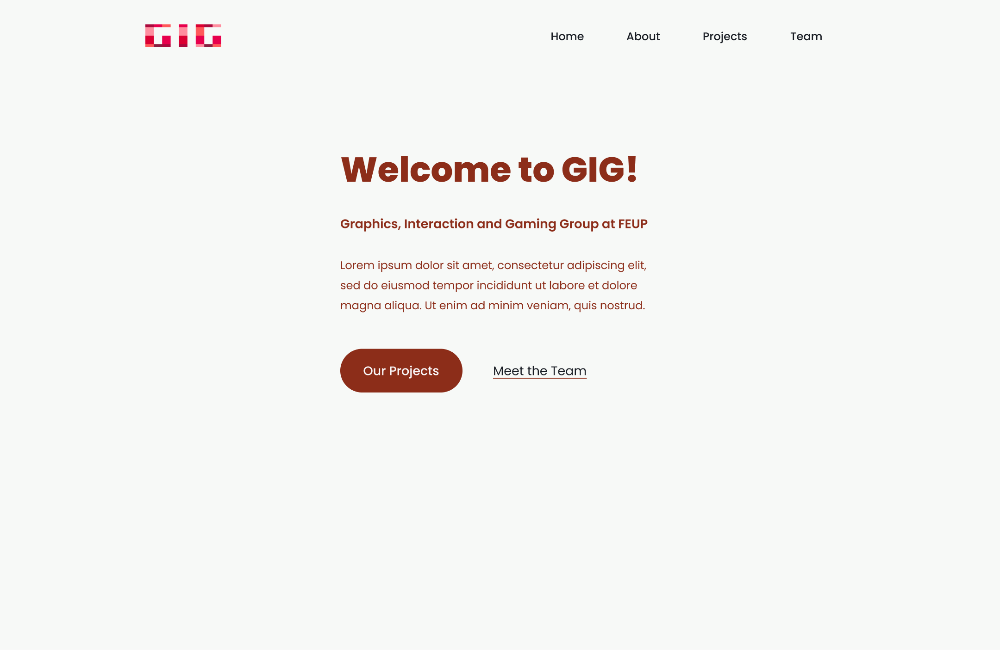
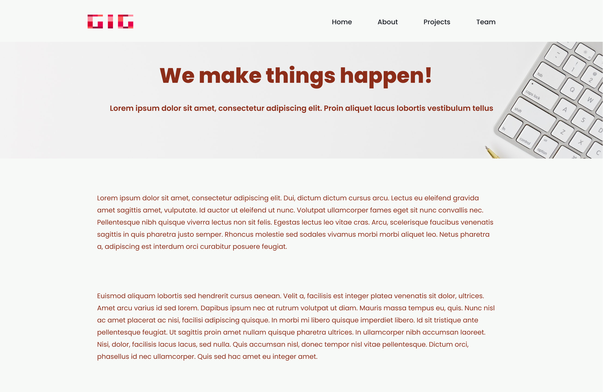
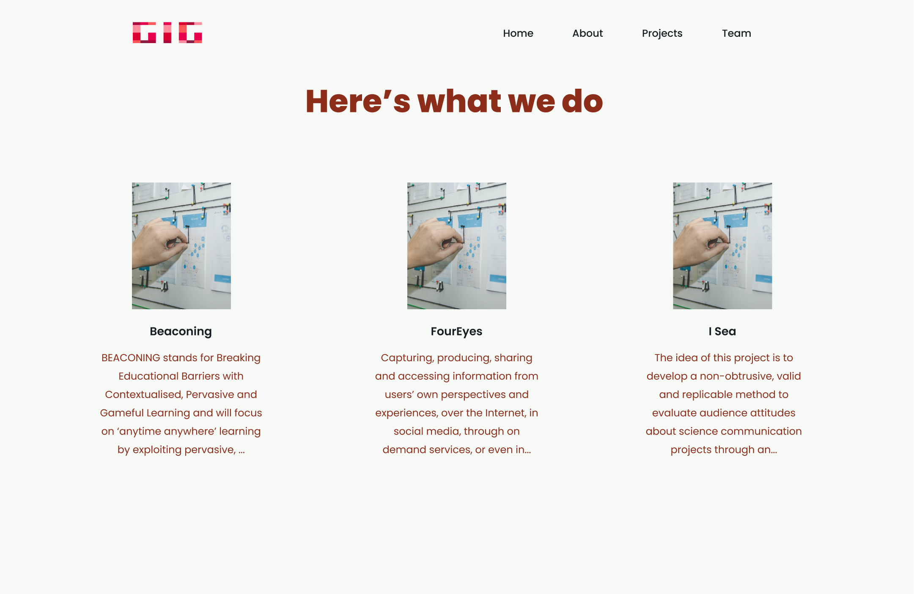
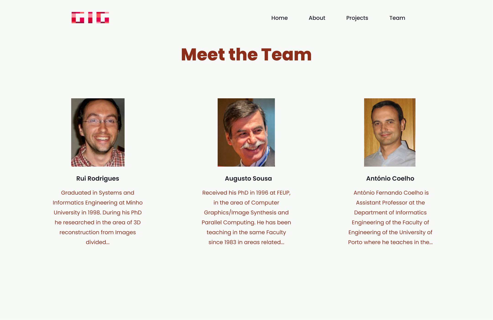

# KISS - Keep It a Simple Site

KISS is a web app that arises from the need to add content to a website in a dynamic fashion, without requiring too much technical knowledge, by taking advantage of an already familiar tool to most people, Google Sheets. It tries to show that there is a viable alternative to heavier programs, without compromising user interaction and accessibility.

Current alternatives have setbacks either regarding the bulky overhead of a Content Management System (CMS) like WordPress, or the technical knowledge required to operate a Static Site Generator (SSG) like Hugo. Therefore, this project aims to show that a good, stable and easy to use website can be built without having to access one of these solutions.

### Main Features

- Google Sheets based model. Each page of a Google Sheet represents a model of an entity, much like a database table, although without the technical knowledge. To add a new entry, simply fill a column in the database
- Client based design. This project will not require a traditional client-server architecture to develop the application. It will rely on a fat client model, which will be in charge of accessing the data, converting it into valid inputs, and injecting it into the webpage.
- Component based website. Each web page present derives from a Vue.js template, which will handle the information injection, styling and interaction with the user. Vue.js was chosen for its lightweight design and speed, emphasizing the need for the website to remain simple.

### Use Cases

The envisioned way to use the site is as follows:

- With the components created and properly set up, the website is made available on a server
- To add an item to the webpage, the User would access the spreadsheet and fill out a new row in the appropriate page
- To remove an item, simply delete the contents from the specified row
- Finally, to edit one, simply edit the appropriate cell in the spreadsheet

### Assumptions and Dependencies

Using the least amount of dependencies possible has been taken into account. This way it limits the amount of overhead the website will have, and it makes it easier to maintain and keep up to date.

Vue.js was used since it speeds up development and allows to make content injection a seamless process. Google Sheets will be used as an easily available and widely used spreadsheet software to design data models. Also, TailwindCSS will be used to help with the styling. To remove dependencies on a server, no back-end will be used, with all functionality residing in the client, including the data conversion engine.

No more foreseeable dependencies are required.

### Design Mockups

The following are design Mockups for a possible webpage for the GIG team, the data from which the current model derives.

##### Home Page

##### About Page

##### Projects Page

##### Team Page

